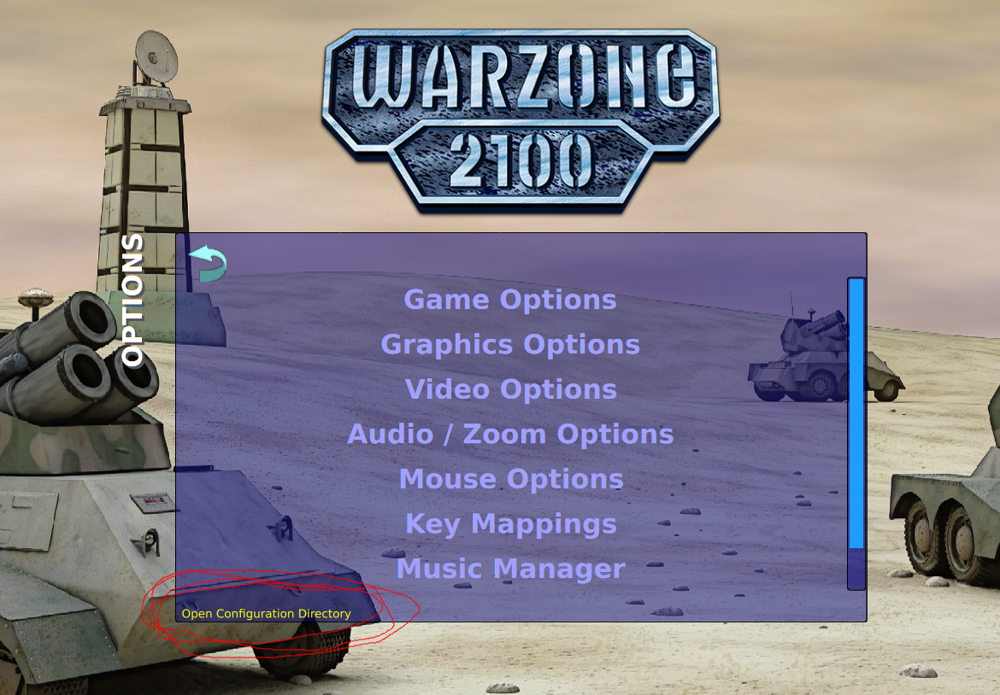

# wz-sequences-french
Warzone2100 cutscenes in French
Les cinématiques en français

# Comment utiliser

Placez le fichier `sequences.wz` dans le dossier de configuration de votre jeu.
Pour savoir ou se trouve ce dossier, lancez le jeu, puis allez dans le menu "Options":

### Format .wz
Pour info, les fichiers .wz sont de simples `.zip`, vous pouvez renommer le fichier pour inspecter le contenu